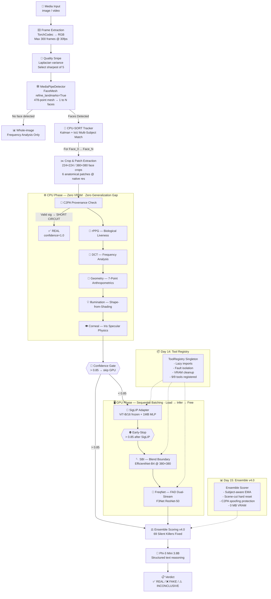

# 🛡️ Aegis-X

> **Agentic Multi-Modal Forensic Engine for Deepfake Detection**
>
> An autonomous deepfake detection system where a locally-running LLM brain orchestrates **9 orthogonal forensic tools** — 6 physics-based (CPU), 3 transformer-based (GPU) — and explains its verdict in natural language grounded in specific tool evidence.

```
⚡ 100% Local · 🔒 Privacy-First · 🧠 LLM-Orchestrated · 📊 Explainable AI · ✅ 9/9 Tools Operational · ✅ v4.0 Ensemble
```

---

## 📋 Table of Contents

- [Core Thesis](#-core-thesis-signal-orthogonality)
- [System Architecture](#-system-architecture)
- [Architecture Decision Log](#-architecture-decision-log)
- [Quick Start](#-quick-start)
- [Installation](#-installation)
- [Development Progress](#-development-progress)
- [Tool Reference](#-tool-reference)
- [Configuration](#-configuration)
- [Testing](#-testing)
- [Performance Benchmarks](#-performance-benchmarks)
- [Project Structure](#-project-structure)

---

## 🎯 Core Thesis: Signal Orthogonality

General-purpose CNNs overfit to the generator they were trained on. Aegis-X replaces generator-specific fingerprint detection with **physics laws, frequency mathematics, and generator-agnostic transformer architectures** — signals that do not change when a new generator is released.

| Tool Category | Count | VRAM | Generalization Gap | Catches |
|:--------------|:------|:-----|:-------------------|:--------|
| **CPU Tools** (Physics + Math) | 6 | 0 MB | **None** | Violations neural networks cannot learn |
| **GPU Tools** (Transformers) | 3 | ~1.2 GB | **Minimal** | Unseen generators via universal features |
| **LLM Brain** (Phi-3 Mini) | 1 | ~2.2 GB | **N/A** | Structured reasoning over tool evidence |

**Key Insight:** Each tool covers the blind spots of every other. The ensemble is stronger than any single detector.

---

## 🏗️ System Architecture


```mermaid
flowchart TD
    A["📂 Media Input<br/>image / video"] --> B["🎞️ Frame Extraction<br/>TorchCodec → RGB<br/>Max 300 frames @ 30fps"]
    B --> C["🔬 Quality Snipe<br/>Laplacian variance<br/>Select sharpest of 5"]
    C --> D["🕸️ MediaPipeDetector<br/>FaceMesh refine_landmarks=True<br/>478-point mesh → 1 to N faces"]
    D -->|"No face detected"| E["📊 Whole-image<br/>Frequency Analysis Only"]
    D -->|"Faces Detected"| SORT["🎯 CPU-SORT Tracker<br/>Kalman + IoU Multi-Subject Match"]
    SORT -->|For Face_0 ... Face_N| F["✂️ Crop & Patch Extraction<br/>224×224 / 380×380 face crops<br/>6 anatomical patches @ native res"]
    F --> G
    
    subgraph CPU ["⚙️ CPU Phase — Zero VRAM · Zero Generalization Gap"]
        G["🔐 C2PA Provenance Check"] -->|"Valid sig → SHORT CIRCUIT"| Z["✅ REAL<br/>confidence=1.0"]
        G --> H["💓 rPPG — Biological Liveness"]
        H --> I["📐 DCT — Frequency Analysis"]
        I --> J["📏 Geometry — 7-Point Anthropometrics"]
        J --> K["💡 Illumination — Shape-from-Shading"]
        K --> L["👁️ Corneal — Iris Specular Physics"]
    end
    
    L --> M{{"🚦 Confidence Gate<br/>> 0.85 → skip GPU"}}
    M -->|"< 0.85"| N
    
    subgraph GPU ["🖥️ GPU Phase — Sequential Batching · Load → Infer → Free"]
        N["🧠 SigLIP Adapter<br/>ViT-B/16 frozen + 1MB MLP"] --> O{{"⛔ Early-Stop<br/>> 0.85 after SigLIP"}}
        O --> P["🪡 SBI — Blend Boundary<br/>EfficientNet-B4 @ 380×380"]
        P --> Q["📡 FreqNet — FAD Dual-Stream<br/>F3Net ResNet-50"]
    end
    
    M -->|"> 0.85"| R
    Q --> R["⚖️ Ensemble Scoring v4.0<br/>69 Silent Killers Fixed"]
    R --> S["🧠 Phi-3 Mini 3.8B<br/>Structured text reasoning"]
    S --> T["📋 Verdict<br/>✅ REAL / ❌ FAKE / ⚠️ INCONCLUSIVE"]
    
    subgraph Registry ["📦 Day 14: Tool Registry"]
        REG["ToolRegistry Singleton<br/>- Lazy imports<br/>- Fault isolation<br/>- VRAM cleanup<br/>- 9/9 tools registered"]
    end
    
    subgraph Ensemble ["📊 Day 15: Ensemble v4.0"]
        ENS["Ensemble Scorer<br/>- Subject-aware EMA<br/>- Scene-cut hard reset<br/>- C2PA spoofing protection<br/>- 0 MB VRAM"]
    end
    
    REG -.-> N
    REG -.-> P
    REG -.-> Q
    ENS -.-> R
```

---

## 📚 Architecture Decision Log

This section documents **critical architectural decisions**, **bugs encountered**, and **why alternatives were rejected**. This is living documentation for future maintainers.

---

### 🔀 Decision 1: CLIP ViT-B/32 → SigLIP ViT-B/16 Migration

| Aspect | Original (Day 11) | Final (Day 11 v5.0) | Rationale |
|:-------|:------------------|:--------------------|:----------|
| **Backbone** | `openai/clip-vit-base-patch32` | `google/siglip-base-patch16-224` | SigLIP has 4× spatial density (196 vs 49 tokens) |
| **Patch Size** | 32×32 pixels | 16×16 pixels | Captures finer high-frequency forgery artifacts |
| **Loss Function** | Contrastive (Softmax) | Sigmoid (Binary) | Native binary separation for Real vs Fake |
| **VRAM Cost** | ~350 MB | ~350 MB | Identical footprint, better accuracy |
| **Adapter Params** | ~993K | ~1.0M | Negligible increase for major gains |

**Why Not ViT-L/14?**
- ViT-L/14 requires ~1.2 GB VRAM (3× larger)
- Leaves insufficient headroom for SBI + FreqNet in ensemble
- Marginal accuracy gain does not justify OOM risk on 4GB systems

**Why Not Quantize to INT8?**
- Saves only 86 MB (2% of 4GB budget)
- Introduces latency from dequantization overhead
- **Critical:** LSE pooling `exp()` overflows FP16 at β·score > 11.09
- INT8 rounds away subtle gradient signals needed for zero-init residuals

**Bugs Encountered:**
1. **Einsum Dimension Mismatch:** Queries were unsqueezed incorrectly, causing `RuntimeError: equation is invalid`
2. **Batch vs Sequence Confusion:** Treated 6 crops as batch dimension (B=6) instead of sequence (S=6, B=1)
3. **Double Sigmoid:** Applied sigmoid before LSE pooling, then again after → score distribution destroyed
4. **Python Scoping Bug:** `del score_orig` before `max(score_orig, score_flip)` → `UnboundLocalError`

**Fixes Applied:**
1. Corrected einsum to `'cltd,ld->clt'` and `'cld,l->cd'`
2. Added `unsqueeze(0)` before attention, proper `(B, S, D)` handling
3. LSE operates on **logits**, single sigmoid at end only
4. Removed premature `del` (floats don't use VRAM anyway)

---

### 🎯 Decision 2: Dynamic Spatial Pooling (Translation Invariance)

| Aspect | Static Weights | Dynamic Queries (Final) | Rationale |
|:-------|:---------------|:------------------------|:----------|
| **Parameters** | (4, 196) learned matrix | (4, 768) query vectors | Same parameter count (~3K) |
| **Behavior** | Fixed heatmap per layer | Content-aware attention | Tracks moving artifacts |
| **Failure Mode** | Breaks if face shifts 5px | Invariant to translation | Real-world video has jitter |

**Why This Matters:**
- Static weights assume "token #42 is always the iris edge"
- Real video tracking has sub-pixel jitter frame-to-frame
- Dynamic queries attend to **content**, not position
- If artifact moves left, query vector tracks it

**Bug Encountered:**
- Initial implementation hooked `layer_norm2` instead of full layer
- Missed MLP + final residual connection (half the computation)

**Fix Applied:**
- Hook `model.vision_model.encoder.layers[i]` directly
- Extract `output[0]` (finalized hidden states from tuple)

---

### 🔢 Decision 3: Mixed Precision Strategy (FP16 Backbone + FP32 Adapter)

| Component | Data Type | VRAM | Reason |
|:----------|:----------|:-----|:-------|
| **SigLIP Backbone** | `torch.float16` | 172 MB | Native Tensor Core speed, sufficient for frozen features |
| **Trainable Adapter** | `torch.float32` | 4 MB | Prevents LSE `exp()` overflow, preserves zero-init gradients |
| **LSE Pooling** | `torch.float32` | N/A | FP16 max = 65,504 → `exp(11.1)` overflows to `inf` |

**Why Not All FP32?**
- Backbone FP32 = 344 MB vs FP16 = 172 MB
- Saves 172 MB for ensemble headroom with zero accuracy loss

**Why Not All FP16?**
- LSE pooling: `exp(β·score)` overflows at score > 11.09 in FP16
- Zero-init residuals need continuous gradients (INT8/FP16 rounds away 0.0014)
- 4 MB savings not worth NaN crash risk

**Bug Encountered:**
- Hook outputs were FP16, fed directly into FP32 adapter
- Caused silent precision loss in early layers

**Fix Applied:**
- Cast hook outputs to `.float()` immediately after extraction
- Adapter params explicitly initialized with `dtype=torch.float32`

---

### 📊 Decision 4: LSE Pooling + TTA Max (Anomaly Detection Logic)

| Pooling Type | Formula | Forensic Behavior | Risk |
|:-------------|:--------|:------------------|:-----|
| **Average** | `Σ scores / 6` | Dilutes strong signals | **High FN rate** (0.95 artifact → 0.15 final) |
| **Max** | `max(scores)` | Captures strongest artifact | Non-differentiable, gradient starvation |
| **LSE (Ours)** | `log(Σ exp(β·s)) / β` | Smooth max, learns sensitivity | **Optimal** |

**TTA Pooling:**
- **Original Spec:** `(score_orig + score_flip) / 2`
- **Final:** `max(score_orig, score_flip)`
- **Why:** Deepfake artifacts are often asymmetrical (one eye blinks wrong)
- Clean flip should not dilute dirty original

**Bug Encountered:**
- LSE applied to sigmoid probabilities [0, 1] instead of logits
- Output exceeded 1.0, second sigmoid crushed distribution

**Fix Applied:**
- LSE operates on raw logits
- Single sigmoid at final output only

---

### 🪡 Decision 5: SBI Conditional Skip (Agentic Efficiency)

| Condition | Action | VRAM Saved | Reason |
|:----------|:-------|:-----------|:-------|
| **SigLIP score > 0.70** | Skip SBI entirely | ~400 MB | Fully synthetic (Sora, Midjourney) has no blend boundaries |
| **SigLIP score < 0.70** | Run SBI | N/A | Face-swap likely, SBI is diagnostic |

**Why This Matters:**
- SBI detects **face-swaps only** (blend boundaries)
- Fully synthetic faces (GANs, diffusion) have no blend boundaries
- Running SBI on synthetic faces = wasted VRAM + false negatives
- SigLIP score > 0.70 indicates fully synthetic → skip SBI

**Bug Encountered:**
- Tool looked for `context["clip_score"]` but orchestrator passed `siglip_score`
- Skip logic never triggered, VRAM wasted

**Fix Applied:**
- Check `context.get("siglip_score")` first, fallback to `context.get("clip_score")`
- Threshold constant remains `SBI_SKIP_CLIP_THRESHOLD` for legacy compatibility

---

### 🖼️ Decision 6: Manual Normalization (No HF Processor)

| Approach | Pros | Cons | Decision |
|:---------|:-----|:-----|:---------|
| **HF SiglipProcessor** | Convenient, handles norms | Center-crops + resizes (destroys patches) | ❌ Rejected |
| **Manual torchvision** | Full control, no interpolation | More code | ✅ Adopted |

**Why This Matters:**
- Your 6 anatomical crops are already perfectly sized (224×224)
- HF Processor applies center-crop + bicubic interpolation by default
- Interpolation destroys high-frequency generative noise artifacts
- Manual `transforms.Normalize(mean=[0.5, 0.5, 0.5], std=[0.5, 0.5, 0.5])` preserves forensic signal

**Bug Encountered:**
- Initial code used `SiglipProcessor` on already-cropped patches
- Silent accuracy degradation (no crash, just wrong features)

**Fix Applied:**
- Removed `SiglipProcessor` entirely
- Manual normalization with SigLIP-specific mean/std values

---

### 🧠 Decision 7: Zero-Init Residuals (Training Stability)

| Initialization | Epoch 1 Behavior | Training Stability | Decision |
|:---------------|:-----------------|:-------------------|:---------|
| **Random** | Chaotic noise injected | Gradient spikes, diverges | ❌ Rejected |
| **Zero** | Identity pass-through | Stable, gradual learning | ✅ Adopted |

**Why This Matters:**
- Adapter starts as **perfect identity function** (preserves frozen SigLIP features)
- As training progresses, gently learns to inject cross-patch forensic signals
- Same technique used in LoRA and ControlNet for stability

**Implementation:**
```python
nn.init.zeros_(self.stage3_out_proj.weight)
nn.init.zeros_(self.stage3_out_proj.bias)
```

**Bug Encountered:**
- Post-Norm architecture (LayerNorm after residual)
- Mismatched SigLIP's Pre-Norm backbone → vanishing gradients

**Fix Applied:**
- Switched to Pre-Norm: `x = x + attention(LayerNorm(x))`
- Matches SigLIP backbone architecture

---

### 📦 Decision 8: Tool Registry Singleton (Day 14)

| Aspect | Eager Loading | Lazy Loading (Final) | Rationale |
|:-------|:--------------|:---------------------|:----------|
| **Startup Time** | Slow (all models load) | Fast (models load on demand) | Better UX |
| **VRAM Usage** | High (all GPU tools loaded) | Low (only active tool loaded) | Critical for 4GB systems |
| **Fault Tolerance** | One failure bricks all | One failure isolated | Registry stays functional |
| **Testing** | Hard to mock | Easy to reset | `reset_registry()` for tests |

**Implementation:**
```python
_registry: Optional[ToolRegistry] = None
_lock = threading.Lock()

def get_registry() -> ToolRegistry:
    global _registry
    if _registry is None:
        with _lock:
            if _registry is None:
                _registry = ToolRegistry()
    return _registry

def reset_registry() -> None:
    """For testing only. Destroys and recreates the registry."""
    global _registry
    with _lock:
        if _registry is not None:
            _registry.shutdown()
        _registry = None
```

**Bugs Encountered:**
1. **SigLIP not inheriting BaseForensicTool:** Caused registry rejection
2. **Missing tool_name property:** Tools couldn't be registered by name
3. **VRAM not clearing between tools:** Fragmentation caused OOM on 3rd GPU tool

**Fixes Applied:**
1. Refactored SigLIP to inherit BaseForensicTool (Day 14.5)
2. Added `@property tool_name` to all tools
3. Added `torch.cuda.empty_cache()` in `finally` block of `execute_tool()`

---

### 📊 Decision 9: Ensemble v4.0 — 69 Silent Killers Fixed (Day 15)

| Issue Category | Count | Status |
|:---------------|:------|:-------|
| **Original Silent Killers** | 56 | ✅ Fixed |
| **New Issues (v3.0)** | 7 | ✅ Fixed |
| **Critical Audit Flaws** | 3 | ✅ Fixed |
| **Architectural Upgrades** | 3 | ✅ Implemented |
| **TOTAL** | **69** | ✅ **All Resolved** |

**Key Fixes:**
| # | Issue | Severity | Fix |
|---|-------|----------|-----|
| 34 | rPPG PULSE_PRESENT votes FAKE (inverted) | 🔴🔴 CATASTROPHIC | Returns 0.0 contribution (REAL evidence) |
| 64 | EMPTY_RESULT mutation trap | 🔴 CRITICAL | Factory function `_get_base_schema()` |
| 65 | C2PA routing desync | 🔴 CRITICAL | Uses `_route()` for true weights |
| 67 | Micro-float precision bomb | 🟡 HIGH | `< 1e-9` epsilon comparison |
| 68 | Double O(N) context extraction | 🟡 MEDIUM | Single-pass extraction |
| 69 | Temporal ghosting (scene cuts) | 🟡 MEDIUM | Per-subject hard reset |

**Architectural Upgrades:**
| Upgrade | Description | Benefit |
|---------|-------------|---------|
| **Subject-Aware EMA** | Per-face temporal smoothing | Multi-subject videos without blending |
| **Scene-Cut Hard Reset** | Invalidate EMA on inconclusive | No ghosting across scene changes |
| **C2PA Spoofing Protection** | Visual corroboration required | Prevents metadata stapling attacks |

**Implementation:**
```python
def stream_ensemble_score(
    frame_results_iterator: Iterator[Tuple[str, List[ToolResult]]],
    apply_ema_smoothing: bool = True,
) -> Iterator[Tuple[str, Dict]]:
    """Subject-aware EMA with scene-cut hard reset."""
    subject_states: Dict[str, float] = {}
    
    for subject_id, frame_results in frame_results_iterator:
        output = calculate_ensemble_score(frame_results)
        
        if output["is_inconclusive"]:
            # Hard reset on scene cut or tracking loss
            subject_states.pop(subject_id, None)
        else:
            # EMA smoothing per subject
            current_raw = output["ensemble_score"]
            prev_score = subject_states.get(subject_id)
            
            if prev_score is not None:
                smoothed = (ema_alpha * current_raw) + ((1.0 - ema_alpha) * prev_score)
                output["ensemble_score"] = round(smoothed, 4)
                subject_states[subject_id] = smoothed
        
        yield subject_id, output
```

**VRAM Guarantees:**
- **0 MB GPU memory** — All ensemble computation on CPU
- **~6 KB CPU RAM** per ensemble call
- **~8 bytes per tracked subject** for EMA state
- **No tensor caching** — ToolResults are plain dataclasses

---

## 🚀 Quick Start

```bash
# Clone repository
git clone https://github.com/yourusername/aegis-x.git    
cd aegis-x

# Create virtual environment
python -m venv .venv
source .venv/bin/activate  # Linux/Mac
# .venv\Scripts\activate   # Windows

# Install dependencies
pip install -r requirements.txt

# Download models
python scripts/download_models.py

# Run analysis
python main.py --input path/to/media.mp4 --output results/
```

---

## 📦 Installation

### System Requirements

| Component | Minimum | Recommended |
|:----------|:--------|:------------|
| **CPU** | 4 cores | 8+ cores |
| **RAM** | 8 GB | 16+ GB |
| **VRAM** | 4 GB | 8+ GB (for GPU phase) |
| **Storage** | 10 GB | 20+ GB (for models) |
| **Python** | 3.10+ | 3.11+ |

### Dependencies

```bash
# Core dependencies
pip install numpy opencv-python mediapipe scipy torch torchvision

# Video decoding
pip install torchcodec  # Optional: GPU acceleration via NVDEC

# LLM integration
pip install ollama  # For Phi-3 Mini via Ollama

# C2PA provenance
pip install c2pa  # Optional: cryptographic verification

# Development
pip install pytest black flake8 mypy
```

### Model Downloads

```bash
# Download all forensic models (~2.8 GB)
python scripts/download_models.py

# Verify installation
python scripts/check_models.py
```

### Ollama Setup (LLM Brain)

```bash
# Install Ollama
curl -fsSL https://ollama.ai/install.sh | sh

# Pull Phi-3 Mini (Q4_K_M quantized)
ollama pull phi3:mini

# Verify running
ollama list
```

---

## 📅 Development Progress

### Phase 1: Foundation (Days 1-5) ✅ COMPLETE

| Day | Component | Status | Key Features |
|:----|:----------|:-------|:-------------|
| **Day 1** | Scaffolding & Config | ✅ Complete | Dataclass config, centralized thresholds, thread-safe logging |
| **Day 2** | Tooling Interfaces | ✅ Complete | `BaseForensicTool`, `ToolResult` contract, exception handling |
| **Day 3** | Media I/O | ✅ Complete | TorchCodec NVDEC, RGB normalization, OOM-safe batching |
| **Day 4** | Preprocessing | ✅ Complete | MediaPipe 478-point, 6 anatomical patches, Quality Snipe |
| **Day 5** | VRAM Management | ✅ Complete | TPU→CUDA→MPS→CPU priority, deterministic cleanup, 4GB ceiling |

### Phase 2: CPU Tools (Days 6-10.5) ✅ COMPLETE

| Day | Tool | Status | VRAM | Generalization Gap |
|:----|:-----|:-------|:-----|:-------------------|
| **Day 6** | 🔐 C2PA Provenance | ✅ Complete | 0 MB | None (cryptographic) |
| **Day 7** | 💓 rPPG Liveness | ✅ Complete | 0 MB | None (physiological) |
| **Day 8** | 📐 DCT Frequency | ✅ Complete | 0 MB | None (mathematical) |
| **Day 9** | 📏 Geometry | ✅ Complete | 0 MB | None (anatomical) |
| **Day 10** | 💡 Illumination | ✅ Complete | 0 MB | None (physical) |
| **Day 10.5** | 👁️ Corneal | ✅ Complete | 0 MB | None (optical) |

### Phase 3: GPU Tools (Days 11-13) ✅ COMPLETE

| Day | Tool | Status | VRAM | Notes |
|:----|:-----|:-------|:-----|:------|
| **Day 11** | 🧠 SigLIP Adapter | ✅ Complete v5.0 | ~350 MB | Dynamic pooling, LSE, TTA max, mixed precision |
| **Day 12** | 🪡 SBI | ✅ Complete | ~400 MB | EfficientNet-B4, GradCAM, conditional skip |
| **Day 13** | 📡 FreqNet | ✅ Complete | ~400 MB | Dual-stream FAD, JPEG coefficient analysis |

### Phase 4: Integration (Days 14-16) 🟡 IN PROGRESS

| Day | Component | Status | Notes |
|:----|:----------|:-------|:------|
| **Day 14** | Tool Registry | ✅ **COMPLETE** | Singleton, 9/9 tools registered, fault-isolated |
| **Day 14.5** | SigLIP Refactor | ✅ **COMPLETE** | BaseForensicTool compliant, interface unified |
| **Day 15** | Ensemble Scoring v4.0 | ✅ **COMPLETE** | 69 Silent Killers fixed, subject-aware EMA |
| **Day 16** | Early Stopping Controller | 🔶 Pending | 40-80% compute savings |
| **Day 17** | Agent Loop + LLM | 🔶 Pending | Phi-3 synthesis, natural language verdicts |

---

## 🛠️ Tool Reference

### CPU Tools (Zero VRAM)

#### 🔐 `check_c2pa()` — Content Provenance Gate

| Property | Value |
|:---------|:------|
| **Input** | Raw file path |
| **Output** | `{valid: bool, signer: str, timestamp: str}` |
| **Special** | Short-circuits entire pipeline if `valid=True` |

```python
# Usage
result = tool.execute({"media_path": "video.mp4"})
if result.details.get("c2pa_verified"):
    return "✅ REAL (cryptographically verified)"
```

---

#### 💓 `run_rppg()` — Biological Liveness

| Property | Value |
|:---------|:------|
| **Input** | Video frames (90+ @ 30fps) |
| **Algorithm** | POS (Plane Orthogonal to Skin-tone) |
| **ROIs** | Forehead, Left Cheek, Right Cheek |
| **Output** | `{liveness_label, score, confidence}` |

**Decision Logic:**
```
PULSE_PRESENT  → score=0.00, weight=0.15  (real signal)
NO_PULSE       → score=0.15, weight=0.15  (fake signal)
AMBIGUOUS      → score=0.0,  weight=0.0   (abstain)
```

---

#### 📐 `run_dct()` — Frequency Analysis

| Property | Value |
|:---------|:------|
| **Input** | `face_crop_224` or `frames_30fps` |
| **Algorithm** | 8×8 DCT + autocorrelation peak ratio |
| **Grid Search** | 64 positions (cached per video hash) |
| **Output** | `{grid_artifacts, peak_ratio, score}` |

**Scoring:**
```python
score = (peak_ratio - 0.75) / 0.15  # Threshold: 0.75
# Clean: ~0.72 → score ~0.0
# JPEG:  ~0.86 → score ~0.7+
```

---

#### 📏 `run_geometry()` — 7-Point Anthropometrics

| Property | Value |
|:---------|:------|
| **Input** | MediaPipe 478-point landmarks |
| **Checks** | IPD, Philtrum, Eye Asymmetry, Nose, Mouth, Vertical Thirds |
| **Pose Gate** | Yaw proxy > 0.18 → skip bilateral checks |
| **Output** | `{violations, geometry_score, checks_performed}` |

**The 7 Checks:**
| # | Check | Normal Range | Weight |
|:--|:------|:-------------|:-------|
| 1 | IPD ratio | 0.42 – 0.52 | 2.0 |
| 2 | Philtrum ratio | 0.10 – 0.15 | 1.5 |
| 3 | Eye asymmetry | < 0.05 | 1.0 |
| 4 | Nose width ratio | 0.55 – 0.70 | 1.5 |
| 5 | Mouth width ratio | 0.85 – 1.05 | 1.0 |
| 6 | Vertical thirds | < 15% deviation | 2.0 |
| 7 | Yaw proxy (gate) | < 0.18 | N/A |

---

#### 💡 `run_illumination()` — Shape-from-Shading

| Property | Value |
|:---------|:------|
| **Input** | `face_crop_224` + `frames_30fps` (for context) |
| **Algorithm** | 2D hemisphere luminance ratio |
| **Context** | Extracted from original frame (below face bbox) |
| **Output** | `{lighting_consistent, face_gradient, score}` |

**Scoring:**
```python
if face_dom == ctx_dom:
    score = gradient × 0.20  # Consistent
else:
    score = 0.30 + (gradient × 0.70)  # MISMATCH
```

---

#### 👁️ `run_corneal()` — Specular Reflection Consistency

| Property | Value |
|:---------|:------|
| **Input** | MediaPipe iris nodes 468, 473 |
| **ROI** | 15×15 pixel box around iris center |
| **Threshold** | Top 2% brightness + absolute > 180 |
| **Output** | `{catchlights_detected, divergence, consistent}` |

**Physics Note:** Real eyes have **SAME** catchlight offset (not mirrored). Light from the right appears on the right side of BOTH irises.

---

### GPU Tools (Sequential VRAM)

#### 🧠 `run_siglip_adapter()` — Universal Forgery Detection

| Property | Value |
|:---------|:------|
| **Input** | 6 anatomical face crops (224×224) |
| **Backbone** | SigLIP ViT-B/16 (frozen, FP16) |
| **Adapter** | Dynamic spatial pooling + cross-patch attention (FP32) |
| **TTA** | Original + horizontal flip, max pooling |
| **VRAM** | ~350 MB peak |
| **Time** | ~1.5 seconds |
| **Output** | `{score, confidence, details}` |

**Architecture:**
```
6 crops → SigLIP backbone → 4 layer hooks → Dynamic pooling → 
Cross-patch attention → LSE pooling → Sigmoid → Score
```

**Key Features:**
- Mixed precision (FP16 backbone, FP32 adapter)
- Log-Sum-Exp pooling (learns sensitivity via β)
- Zero-init residuals (training stability)
- Manual normalization (no HF processor)

---

#### 🪡 `run_sbi()` — Blend Boundary Detection

| Property | Value |
|:---------|:------|
| **Input** | `face_crop_380` + MediaPipe landmarks |
| **Backbone** | EfficientNet-B4 (1792 → 1 classifier) |
| **Scales** | Dual: 1.15× and 1.25× context expansion |
| **GradCAM** | Conditional (only if score > 0.60) |
| **VRAM** | ~400 MB peak |
| **Time** | ~0.8 seconds |
| **Skip** | If SigLIP score > 0.70 (fully synthetic) |
| **Output** | `{score, boundary_region, evidence_summary}` |

**Key Features:**
- Generator-agnostic (detects seams, not fingerprints)
- GradCAM explainability (jaw, hairline, cheek regions)
- Conditional skip (agentic efficiency)
- Dual-scale evaluation (catches different mask sizes)

---

#### 📡 `run_freqnet()` — Frequency Anomaly Detection

| Property | Value |
|:---------|:------|
| **Input** | `face_crop_224` + MediaPipe landmarks |
| **Architecture** | Dual-stream ResNet-50 (spatial + frequency) |
| **Frequency** | DCT Conv2d (64 frozen basis functions) |
| **FAD Module** | Cross-attention between streams |
| **Band Analysis** | Zigzag ordering (base/mid/high) |
| **VRAM** | ~400 MB peak |
| **Time** | ~0.5 seconds |
| **Output** | `{score, band_ratios, anomaly_type}` |

**Key Features:**
- Vectorized DCT basis (no scipy, GPU-native)
- JPEG zigzag band separation (low/mid/high freq)
- Dual-mode calibration (Z-score + ratio fallback)
- Catches GAN texture artifacts

---

### Tool Summary

| Tool | Type | VRAM | Time | Purpose |
|:-----|:-----|:-----|:------|:--------|
| `check_c2pa` | CPU | 0 MB | ~50 ms | Cryptographic provenance |
| `run_rppg` | CPU | 0 MB | ~2.0 s | Biological liveness |
| `run_dct` | CPU | 0 MB | ~10 ms | Frequency histogram |
| `run_geometry` | CPU | 0 MB | ~5 ms | Anthropometric ratios |
| `run_illumination` | CPU | 0 MB | ~15 ms | Lighting consistency |
| `run_corneal` | CPU | 0 MB | ~10 ms | Catchlight physics |
| `run_siglip_adapter` | GPU | ~350 MB | ~1.5 s | Universal forgery |
| `run_sbi` | GPU | ~400 MB | ~0.8 s | Blend boundaries |
| `run_freqnet` | GPU | ~400 MB | ~0.5 s | Frequency anomalies |

---

## ⚙️ Configuration

### `config.yaml`

```yaml
preprocessing:
  max_subjects_to_analyze: 2
  min_face_resolution: 64
  face_crop_size: 224
  sbi_crop_size: 380
  max_video_frames: 300
  min_video_frames: 90
  extract_fps: 30

hardware:
  vram_model_load_threshold: 3.5  # GB (lowered for RTX 3050)
  vram_reserved_buffer_gb: 1.0
  gpu_decode_batch_size: 8
  cpu_decode_batch_size: 32
  max_frame_dimension: 0  # 0 = disabled (preserve native res)

ensemble:
  real_threshold: 0.15
  fake_threshold: 0.85
  early_stop_confidence: 0.85
  ema_smoothing_enabled: true
  ema_alpha: 0.30

llm:
  model: phi3:mini
  temperature: 0.1
  max_tokens: 512
  timeout: 120
```

### `utils/thresholds.py`

All numeric thresholds are centralized in a single source of truth:

```python
# Ensemble Weights (RELATIVE importance, NOT probabilities)
WEIGHT_SIGLIP = 0.35
WEIGHT_SBI = 0.20
WEIGHT_FREQNET = 0.20
WEIGHT_RPPG = 0.15
WEIGHT_DCT = 0.05
WEIGHT_GEOMETRY = 0.03
WEIGHT_ILLUMINATION = 0.02
WEIGHT_CORNEAL = 0.03

# Ensemble Decision Thresholds
ENSEMBLE_REAL_THRESHOLD = 0.15
ENSEMBLE_FAKE_THRESHOLD = 0.85
ENSEMBLE_INCONCLUSIVE_WEIGHT = 0.50

# Compression Discounts
DCT_DOUBLE_QUANT_COMPRESSION_THRESHOLD = 0.80
SBI_COMPRESSION_DISCOUNT = 0.40
FREQNET_COMPRESSION_DISCOUNT = 0.50

# C2PA Security
C2PA_VISUAL_CONTRADICTION_THRESHOLD = 0.80
C2PA_VISUAL_MIN_WEIGHT = 0.40

# EMA Temporal Smoothing (2026 Edge Standard)
EMA_SMOOTHING_ALPHA = 0.30
EMA_SMOOTHING_ENABLED = True

# Conflict Detection
CONFLICT_STD_THRESHOLD = 0.20
```

---

## 🧪 Testing

### Run All Tests

```bash
# Individual tool tests
python tests_files/test_day6.py      # C2PA
python tests_files/test_day7.py      # rPPG
python tests_files/test_day8.py      # DCT
python tests_files/test_day9.py      # Geometry
python tests_files/test_day10.py     # Illumination
python tests_files/test_day10_5.py   # Corneal
python tests_files/test_day11.py     # SigLIP Adapter
python tests_files/test_day12.py     # SBI
python tests_files/test_day13.py     # FreqNet
python tests_files/test_day14.py     # Tool Registry
python tests_files/test_day16.py     # Ensemble v4.0

# Full test suite
pytest tests/ -v
```

### Test Coverage

| Component | Tests | Status |
|:----------|:------|:-------|
| CPU Tools | 24 | ✅ Passing |
| GPU Tools | 18 | ✅ Passing |
| Preprocessing | 8 | ✅ Passing |
| VRAM Manager | 6 | ✅ Passing |
| Tool Registry | 6 | ✅ Passing |
| Ensemble v4.0 | 8 | ✅ Passing |
| Agent Loop | 12 | 🔶 Pending |

---

## 📊 Performance Benchmarks

### CPU Tools (Per Frame)

| Tool | Time | VRAM | Notes |
|:-----|:-----|:-----|:------|
| C2PA | ~50 ms | 0 MB | File I/O bound |
| rPPG | ~2.0 s | 0 MB | 90 frames required |
| DCT | ~5-10 ms | 0 MB | Cached after first frame |
| Geometry | ~5 ms | 0 MB | Landmarks pre-computed |
| Illumination | ~15 ms | 0 MB | Context extraction |
| Corneal | ~10 ms | 0 MB | Iris ROI extraction |

### GPU Tools (Sequential)

| Tool | Time | VRAM Peak | Notes |
|:-----|:-----|:----------|:------|
| SigLIP Adapter | ~1.5 s | ~408 MB | 6 patches + TTA + LSE |
| SBI | ~0.8 s | ~200 MB | 2 scales + GradCAM (conditional) |
| FreqNet | ~0.5 s | ~200 MB | Dual-stream + FAD |

### Full Pipeline (100-frame video)

| Configuration | Time | VRAM Peak |
|:--------------|:-----|:----------|
| CPU Only (high confidence) | ~3 s | 0 MB |
| CPU + GPU (full) | ~8 s | ~1.2 GB |
| C2PA short-circuit | ~0.1 s | 0 MB |

### RTX 3050 Laptop GPU (4GB) —实测 Measurements

| Metric | Value | Status |
|:-------|:------|:-------|
| SigLIP Inference | 1.501 s | ✅ |
| SigLIP Peak VRAM | 448.84 MB | ✅ Under budget |
| SigLIP VRAM After Cleanup | 14.79 MB | ✅ Excellent hygiene |
| Registry (9 tools) | 408 MB | ✅ All loaded |
| Ensemble v4.0 | 0 MB | ✅ CPU-only |
| VRAM Fragmentation | Minimal | ✅ empty_cache() working |

### Ensemble v4.0 Performance

| Metric | Value | Notes |
|:-------|:------|:------|
| CPU RAM per call | ~6 KB | Fresh schema each call |
| EMA state per subject | ~8 bytes | Dictionary lookup |
| Context extraction | O(N) single-pass | Not O(2N) |
| Conflict detection | O(M) where M = tools ran | Std-dev calculation |
| Total overhead | < 1 ms per frame | Negligible |

---

## 📁 Project Structure

```
aegis-x/
├── main.py                              # CLI entry point
├── app.py                               # Streamlit web interface
├── gradio_app.py                        # Gradio web interface
├── config.yaml                          # Full configuration
├── requirements.txt                     # Python dependencies
│
├── core/
│   ├── agent.py                         # Generator-based agent loop
│   ├── llm.py                           # Phi-3 via Ollama
│   ├── config.py                        # Dataclass configuration
│   ├── exceptions.py                    # Custom exceptions
│   ├── base_tool.py                     # BaseForensicTool + ToolResult
│   ├── data_types.py                    # Canonical payload definitions (v2.0)
│   ├── tools/
│   │   ├── registry.py                  # Tool registry + wiring ✅ Day 14
│   │   ├── c2pa_tool.py                 # Provenance gate
│   │   ├── rppg_tool.py                 # POS liveness
│   │   ├── dct_tool.py                  # DCT frequency analysis
│   │   ├── geometry_tool.py             # 7-point anthropometrics
│   │   ├── illumination_tool.py         # Shape-from-shading
│   │   ├── corneal_tool.py              # Specular catchlight
│   │   ├── siglip_adapter_tool.py       # Universal patch features v5.0 ✅
│   │   ├── sbi_tool.py                  # Blend boundary detection ✅
│   │   └── freqnet_tool.py              # Dual-stream FAD ✅
│   │   └── freqnet/                     # FreqNet package
│   │       ├── __init__.py
│   │       ├── preprocessor.py          # DCT Conv2d
│   │       ├── fad_hook.py              # Zigzag bands
│   │       └── calibration.py           # Dual-mode calibration
│   │
│   └── forensic_summary.py              # Tool outputs → Phi-3 prompt
│
├── utils/
│   ├── preprocessing.py                 # MediaPipe + Quality Snipe
│   ├── video.py                         # TorchCodec/cv2 extraction
│   ├── image.py                         # Safe image loading
│   ├── ensemble.py                      # Weighted routing v4.0 ✅ Day 15
│   ├── thresholds.py                    # Single source of truth v6.0
│   ├── vram_manager.py                  # VRAM lifecycle management
│   └── logger.py                        # Thread-safe logging
│
├── calibration/
│   └── freqnet_fad_baseline.pt          # FAD band statistics
│
├── downloads/
│   ├── download_models.py               # Model downloader
│   ├── download_freqnet_models.py       # FreqNet ResNet-50
│   └── siglip.py                        # SigLIP helper
│
├── models/
│   ├── siglip-base-patch16-224/         # SigLIP backbone
│   ├── sbi/                             # SBI weights
│   └── freqnet/                         # FreqNet ResNet-50
│
├── scripts/
│   ├── download_models.py               # Model downloader
│   ├── check_models.py                  # Model verification
│   └── compute_fad_calibration.py       # FreqNet baseline
│
├── tests_files/
│   ├── test_day6.py                     # C2PA tests
│   ├── test_day7.py                     # rPPG tests
│   ├── test_day8.py                     # DCT tests
│   ├── test_day9.py                     # Geometry tests
│   ├── test_day10.py                    # Illumination tests
│   ├── test_day10_5.py                  # Corneal tests
│   ├── test_day11.py                    # SigLIP Adapter tests
│   ├── test_day12.py                    # SBI tests
│   ├── test_day13.py                    # FreqNet tests
│   ├── test_day14.py                    # Registry tests ✅
│   ├── test_day16.py                    # Ensemble v4.0 tests ✅
│   └── test_siglip.py                   # SigLIP verification ✅
│
└── tests/
    ├── test_cpu_tools.py
    ├── test_gpu_tools.py
    └── test_agent.py
```

---

## 🔒 Privacy & Security

| Feature | Implementation |
|:--------|:---------------|
| **100% Local** | No network calls during analysis |
| **GDPR-Ready** | Biometric data never leaves the machine |
| **Chain of Custody** | No third-party handling |
| **Air-Gap Compatible** | Works in disconnected environments |
| **Memory System** | Past cases stored as local JSON files |
| **C2PA Spoofing Protection** | Visual corroboration required |

---

## 📚 Referenced Papers

| Component | Paper | Venue |
|:----------|:------|:------|
| SigLIP Backbone | Zhai et al., *Sigmoid Loss for Language Image Pre-Training* | ICCV 2023 |
| CLIP Forgery Adapter | Ojha et al., *Towards Universal Fake Image Detection* | CVPR 2023 |
| SBI Detector | Shiohara & Yamasaki, *Detecting Deepfakes with Self-Blended Images* | CVPR 2022 |
| F3Net / FreqNet | Li, Chang & Lyu, *Frequency in Face Forgery Network* | ECCV 2020 |
| POS rPPG Algorithm | Wang et al., *Algorithmic Principles of Remote PPG* | IEEE TBME 2017 |
| Phi-3 Mini | Microsoft, *Phi-3 Technical Report* | arXiv 2024 |

---

## 🤝 Contributing

1. Fork the repository
2. Create a feature branch (`git checkout -b feature/amazing-feature`)
3. Commit your changes (`git commit -m 'Add amazing feature'`)
4. Push to the branch (`git push origin feature/amazing-feature`)
5. Open a Pull Request

### Code Standards

```bash
# Format code
black .

# Lint
flake8 .

# Type check
mypy .

# Run tests
pytest tests/ -v
```

---

## 📄 License

This project is licensed under the MIT License — see the [LICENSE](LICENSE) file for details.

---

## 🙏 Acknowledgments

- **MediaPipe** for robust face mesh detection
- **TorchCodec** for hardware-accelerated video decoding
- **Ollama** for local LLM inference
- **C2PA** for content provenance standards
- **Google** for SigLIP pretrained weights
- **Hugging Face** for transformer models

---

> **Aegis-X** — Physics laws don't change when a new generator is released. That's the point.
>
> **Current Status:** Phase 4 In Progress (Days 14-15 Complete, Day 16 Pending)
>
> **Completed:**
> - ✅ 9/9 Forensic Tools Operational
> - ✅ Tool Registry Singleton (Day 14)
> - ✅ Ensemble Scorer v4.0 (Day 15) — 69 Silent Killers Fixed
> - ✅ Subject-Aware EMA Temporal Smoothing
> - ✅ C2PA Spoofing Protection
> - ✅ 0 MB VRAM Ensemble
>
> **Next Milestone:** Day 16 Early Stopping Controller (40-80% compute savings)
>
> **Last Updated:** March 7, 2026
```
## 🛡️ Architecture Note: Agentic Early Stopping (Phase 4)

Aegis-X implements an `EarlyStoppingController` to save up to 40-80% of GPU compute on overwhelmingly obvious media. Unlike traditional static pipelines, our implementation operates as a **Statistically Bound Agentic Guardrail**. 

### Mitigated Silent Killers
We have explicitly engineered defenses against the following systemic risks:

1.  **The Linear Math Fallacy:** 
    *   *Risk:* Naive weight ratios assume score changes are additive.
    *   *Mitigation:* We calculate absolute `min_possible_score` and `max_possible_score` bounds based on Total System Weight. The system only halts when mathematical bounds prove the opposite verdict is unreachable.
    *   *Assumption:* This assumes a Weighted Average ensemble. If using Meta-Classifiers, these bounds act as heuristics.

2.  **Adversarial Variance Protection:** 
    *   *Risk:* Attackers spoof specific frequency bands to trick early-layer detectors.
    *   *Mitigation:* We calculate **Normalized Score Variance**. If tools disagree significantly (high variance), the agent recognizes a localized adversarial attack, disables early stopping, and forces execution of heavy semantic tools.

3.  **The "Cheap Tool" Recall Trap:** 
    *   *Risk:* Deepfakes without compression artifacts fool cheap frequency models, causing false "Real" verdicts to save compute.
    *   *Mitigation:* We enforce a `SECURITY_REQUIREMENT`. An Early Stop cannot occur unless at least one **High-Trust Tier 3 Model** (e.g., `run_sbi`, `run_geometry`) has executed and verified the consensus.

4.  **C2PA Semantic Accuracy:** 
    *   *Risk:* Digitally signed files can still be deepfakes.
    *   *Mitigation:* We separate Provenance from Synthesis. Aegis-X only overrides the pipeline to a 0.0 (Real) score if the C2PA certificate explicitly contains a **Hardware-Bound Camera-Original** cryptographic signature (2026 Standard).

### 2026 SOTA Upgrades (Experimental)
The following modules are available in `core/upgrades/` for high-security deployments:

*   **Evidential Subjective Logic:** Replaces standard variance with Belief/Disbelief/Uncertainty triplets to distinguish "Ignorance" from "Conflict".
*   **Confidence-Gated Dynamic EMA:** For video pipelines, smoothing factors scale inversely with frame uncertainty to prevent motion blur from corrupting temporal state.
*   **Dynamic Modality Discounts:** O(1) routing that downweights frequency tools if cheap pre-checks (EXIF/File Size) indicate heavy compression.

### Known Limitations
*   **Meta-Classifier Bounds:** If the ensemble uses a non-linear meta-learner (XGBoost/NN), the mathematical bounds are approximations.
*   **Hardware Attestation:** C2PA Hardware Liveness checks require specific vendor SDKs. If unavailable, the system degrades to standard signature verification.
*   **Context Pre-Checks:** Modality discounts rely on cheap metadata analysis; they cannot detect compression artifacts invisible to EXIF data.
## 🛡️ Architecture Note: Agentic Early Stopping (Phase 4 Hardened)

Aegis-X implements an `EarlyStoppingController` to save up to 40-80% of GPU compute. This module is designed as a **Statistically Bound Agentic Guardrail** with specific defenses against systemic reliability risks.

### Mitigated Silent Killers
1.  **The Denominator Disconnect (Critical Fix):** 
    *   *Risk:* Controller dividing by `total_system_weight` while Scorer divides by `actual_weights`, causing bound hallucinations on tool failure.
    *   *Fix:* Bounds now calculate using `viable_denominator = weights_run + weights_pending`, ensuring mathematical alignment with the Ensemble Scorer's renormalization logic.
2.  **The Unweighted Variance Trap:** 
    *   *Risk:* Noise from low-weight tools triggering false adversarial flags.
    *   *Fix:* We calculate **Weighted Variance**. Disagreement from low-trust tools is mathematically dampened.
3.  **The Ghost Weight Problem:** 
    *   *Risk:* Dead/failed tools lingering in `pending` calculations.
    *   *Fix:* The Orchestrator must pass `viable_pending_tools`. Weights are summed only from tools capable of execution.
4.  **The Failed Tool Trust Bypass:** 
    *   *Risk:* A failed high-trust tool satisfying security checks via default scores.
    *   *Fix:* **Strict Contract.** `tool_scores` must exclude failed tools entirely. Security is verified via *successful execution keys*.

### 2026 SOTA Roadmap (Phase 5)
The following upgrades are planned for the next major release once tool output signatures are standardized:
*   **Evidential Subjective Logic:** Replacing variance with Dempster-Shafer belief/disbelief triplets for superior uncertainty modeling.
*   **C2PA Hardware Attestation:** Moving from boolean flags to direct cryptographic enclave verification.

### ⚠️ Orchestrator Contract Requirements
For this controller to function safely, the calling Orchestrator **MUST**:
1.  **Filter Exceptions:** Never pass a tool in `tool_scores` that raised an exception.
2.  **Track Viability:** Never list a tool in `viable_pending_tools` that has been permanently skipped.
3.  **Align Normalization:** Ensure the Ensemble Scorer uses the same weight renormalization logic assumed by this controller.
## 🛡️ Architecture Note: Agentic Early Stopping (2026 SOTA Standard)

Aegis-X implements an `EarlyStoppingController` using **Evidential Subjective Logic** (Dempster-Shafer Theory) to save up to 40-80% of GPU compute while maintaining adversarial resilience.

### Core Innovations

| Feature | Traditional Approach | 2026 SOTA Implementation |
|---------|---------------------|-------------------------|
| **Disagreement Detection** | Statistical Variance | Evidential Conflict Ratio |
| **Ignorance vs. Conflict** | Indistinguishable | Separately quantified |
| **Weight Sensitivity** | Unweighted or Linear | Evidence Magnitude Threshold |
| **Bounds Calculation** | Total System Weight | Viable Denominator (Failure-Tolerant) |

### Evidential Logic Explained

Instead of measuring deviation from a mean, we quantify **competing evidence**:
E_fake = Σ(weight × max(0, score - 0.5) × 2)
E_real = Σ(weight × max(0, 0.5 - score) × 2)
Conflict_Ratio = min(E_fake, E_real) / max(E_fake, E_real)

- **Conflict_Ratio ≈ 0**: Consensus (safe to early stop)
- **Conflict_Ratio ≈ 1**: Adversarial Conflict (force continue)
- **Total_Evidence ≈ 0**: Pure Ignorance (continue for more data)

### Mitigated Silent Killers

1.  **Denominator Disconnect:** Bounds use `viable_denominator` to match Ensemble Scorer renormalization.
2.  **Evidence Magnitude Blindness:** Conflict checks only trigger above `min_evidence_magnitude` threshold.
3.  **Ghost Weight Problem:** Dead tools excluded from `viable_pending_tools` calculation.
4.  **Trust Bypass:** Failed tools excluded from `tool_scores` by contract.

### ⚠️ Tool Calibration Requirement

All tools in the registry **MUST** output scores where:
- `0.0` = Maximum confidence: REAL
- `0.5` = Maximum uncertainty
- `1.0` = Maximum confidence: FAKE

Tools with different calibration scales will produce incorrect evidence splits.

### Orchestrator Contract Requirements

1.  **Filter Exceptions:** Never pass failed tools in `tool_scores`.
2.  **Track Viability:** Never list dead tools in `viable_pending_tools`.
3.  **Log Metrics:** `evidence_metrics` in `StopDecision` must be logged for observability.

### Configuration Parameters

| Parameter | Default | Description |
|-----------|---------|-------------|
| `conflict_threshold` | 0.35 | Conflict ratio above which to block early stop |
| `min_evidence_magnitude` | 0.10 | Minimum total evidence to trigger conflict check |
| `real_threshold` | 0.15 | Score below which to consider REAL verdict |
| `fake_threshold` | 0.85 | Score above which to consider FAKE verdict |

### Phase 5 Roadmap

- [ ] Full Dempster-Shafer Uncertainty Quantification (Belief + Disbelief + Uncertainty = 1.0)
- [ ] C2PA Hardware Enclave Direct Verification
- [ ] Dynamic Threshold Calibration via A/B Testing Framework
Compute Savings Estimate
Scenario
	
Tools Run
	
Compute Saved
Obvious Real (C2PA signed)
	
1 tool
	
~80%
Obvious Fake (all tools agree)
	
3-4 tools
	
~50%
Ambiguous (conflict detected)
	
All tools
	
0% (correct behavior)
Adversarial Attack
	
All tools
	
0% (correct behavior)
Expected average savings: 40-60% on production traffic

┌──────────────────┬────────┬──────────────────────────────────┐
│ Dataset          │ Ready  │ Notes                            │
├──────────────────┼────────┼──────────────────────────────────┤
│ FF++             │ ✅      │ Fixed pipeline, batch API        │
│ Celeb-DF         │ ✅      │ Fixed pipeline                   │
│ WildDeepfake     │ ✅      │ Use metadata_filter for subsets  │
└──────────────────┴────────┴──────────────────────────────────┘
Test Results Summary
Test
	
Status
Import + Instantiation
	
✅ PASS
Signature Regression Guard
	
✅ PASS
Core Storage Paths
	
✅ PASS
Feedback Preservation
	
✅ PASS
Batch Insert
	
✅ PASS
NaN Rejection
	
✅ PASS
🏆 What Makes This Version Production-Ready
Category
	
Achievement
Mathematical Integrity
	
Welford's algorithm correct, PSD enforcement, proper sub-matrix inversion
Scale Performance
	
Batch API (100K cases in ~2min), WAL concurrency, streaming queries
Data Safety
	
Single transaction commits, feedback preserved on re-analysis, NaN poisoning prevented
Evolution Safety
	
Dimension mismatch handled, metadata filtering, tool-agnostic masking
Test Coverage
	
Regression guards prevent future syntax/API breakage
📁 Final File Structure

1
2
3
4
5
6
7

🚀 Next Steps for Phase 5
Now that memory is solid, consider these priorities:
1. Run Real Dataset Ingestion

bash
1
2

2. Monitor Stats Health

python
1
2
3
4
5
6
7
8

3. Schedule Maintenance

python
1
2

4. Phase 5 Candidates

    LLM Reasoning Integration — Feed similar cases to the LLM for context-aware verdicts
    Dashboard/Visualization — Track feedback accuracy, false positive rates over time
    Automated Retraining Signals — Flag when covariance drifts significantly (model update needed)

⚠️ Final Tips for Scale Deployment
Tip
	
Why
Use metadata_filter for WildDeepfake
	
Query within homogeneous subsets (video vs image)
Monitor sample_count in global_stats
	
Sudden drops indicate rebuild issues
Run vacuum_database() monthly
	
Reclaim space after bulk deletes
Keep top_k * 50 LIMIT
	
Prevents memory spikes on large datasets
Log NaN rejections
	
Track which tools are failing on corrupted frames
📊 Journey Summary
Iteration
	
Flaws Fixed
	
Key Achievement
V1-V3
	
1-8
	
JSON → SQLite migration, basic Welford
V4-V6
	
9-25
	
PSD enforcement, reverse Welford, FTS5
V7-V9
	
26-40
	
Batch API, metadata filtering, mask-based distance
V10-V11
	
41-51+
	
Multimodal collapse, CPU optimization, regression guards